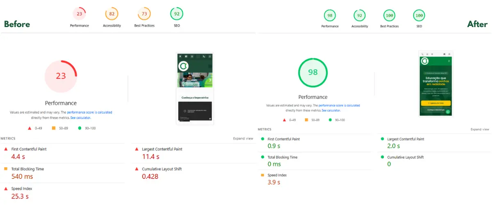

# Colégio Imperatrice

A high-performance, modern school website built with **Astro 5**, serving as a real-world **Rush CMS** showcase. This project demonstrates Rush CMS's capabilities in managing dynamic content, menus, and SEO configurations for complex institutional websites.

> Goal of this repo: be a *verifiable* showcase (not just claims).
> - Proof: PageSpeed before/after + live URLs
> - How: clear editorial workflow

## Live + Proof

- Production: https://colegioimperatrice.com.br


Links for the tests: [first test (old website)](https://pagespeed.web.dev/analysis/https-colegioimperatrice-com-br/rjh5ih5tai?form_factor=mobile&hl=en) and [second test (new website)](https://pagespeed.web.dev/analysis/https-colegio-imperatrice-vercel-app/x2702sshte?form_factor=mobile&hl=en)

> Note: PageSpeed varies with time/device/location. These links are snapshots used as a reference, not a guarantee.

## Editorial workflow (Rush CMS → static website)

This repo follows a “content-first” workflow:

```text
Editors (Rush CMS UI)
  ├─ Create/Update content (Blog / Events / Highlights)
  ├─ Update menus (Topbar / Main / Footer)
  └─ Update SEO settings (title, description, social, etc.)
              │
              ▼
Rush CMS API (Headless)
              │
              ▼
Astro build (SSG)
  ├─ Fetches content & navigation from Rush CMS
  ├─ Renders pages to static HTML
  ├─ Generates SEO-friendly output (metadata, sitemap)
  └─ Optimizes assets (images, etc.)
              │
              ▼
Deploy (Vercel / Coolify / static hosting)
  └─ Publishes static site (fast TTFB, cache-friendly)
```

This showcase demonstrates that **Rush CMS** can power rich, frequently updated content while keeping a static/performance-oriented delivery model.

## Technologies

- **Framework**: [Astro v5](https://astro.build), static website
- **CMS**: [Rush CMS](https://rushcms.com), the Headless CMS with static deploy button
- **UI**: Astro Components & Vanilla TypeScript (Zero JS by default)
- **Styling**: [Tailwind CSS v4](https://tailwindcss.com)
- **Icons**: Unplugin Icons (Lucide)

## Features & Rush CMS integration

This project uses Rush CMS as the single source of truth for content.

### Dynamic content
- **Events and Highlights**: paginated listings (`/eventos`, `/destaques`) with cover images, galleries, and rich text
- **Blog**: full news system with Rich Text rendering (Tiptap JSON → HTML) for performance and SEO
- **Pagination**: frontend-driven pagination size + Rush-powered data listing

### Data structure (rush.config.ts)
The **configuration file** centralizes the mapping between routes and CMS collections:

- **Route maps**: associates URLs (`/` as pages, `/blog`, `/eventos`, `/destaques`) with Rush route IDs
- **Internationalization**: locale configured as pt_BR
- **Dynamic IDs**: uses environment variables for navs, forms, route IDs, etc.

### Optimized components
- **Images**: uses astro:assets and optimized images coming from the CMS
- **Forms**: contact form integrated via Rush CMS API

## Where to look in the code

If you’re evaluating this repo as a Rush CMS showcase, these are the “audit points”:

- Rush integration config: rush.config.ts
- Environment-driven IDs (`navs`/`forms`/`routes`): configured via environment variables (values intentionally not included in this repo)
- Routes `/pages`:
  - `/blog` listing + pagination
  - `/eventos` listing + pagination
  - `/destaques` listing + pagination
- Rich text renderer (Tiptap JSON → HTML)
- Navigation building (Rush nav IDs)
- SEO

## License

This project is a proprietary showcase. All content and design rights reserved to Colégio Imperatrice. Source code available for educational and Rush CMS demonstration purposes.